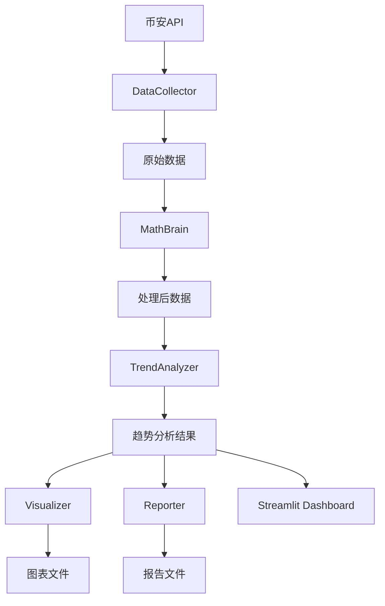

# ETH HMA Analysis - 技术手册

## 📋 目录

1. [项目概述](#项目概述)
2. [数据采集指南](#数据采集指南)
3. [数据处理流程](#数据处理流程)
4. [数据分析流程](#数据分析流程)
5. [报表生成说明](#报表生成说明)
6. [Financial Dashboard使用指南](#financial-dashboard使用指南)
7. [技术架构说明](#技术架构说明)
8. [故障排除](#故障排除)

## 📚 详细技术文档

- [数据处理流程指南](data_processing_guide.md) - 完整的数据处理流程说明
- [数据流程图解](data_flow_diagram.md) - 可视化数据流程图
- [API参考文档](api_reference.md) - 完整的API接口说明
- [快速开始指南](quick_start.md) - 快速上手指南
- [数据采集指南](data_collection_guide.md) - 数据采集详细说明
- [分析指南](analysis_guide.md) - 数据分析流程说明
- [Dashboard指南](dashboard_guide.md) - Dashboard使用说明
- [AI代理指南](ai_agent_guide.md) - AI代理专用指南

---

## 项目概述

### 🎯 项目目标
基于Hull移动平均(HMA)技术指标，对ETH/USDT价格数据进行趋势分析，识别交易机会和风险点。

### 🔧 核心技术栈
- **数据采集**: Binance API
- **数据处理**: pandas, numpy
- **技术指标**: Hull Moving Average (HMA)
- **可视化**: matplotlib, plotly, streamlit
- **数据存储**: Parquet格式

### 📊 分析维度
- **时间级别**: 1小时、4小时
- **趋势识别**: 上升趋势、下降趋势
- **风险指标**: PFE、MAE、风险收益比
- **策略评估**: 做多/做空策略表现

---

## 数据采集指南

### 🚀 快速开始

```bash
# 1. 激活虚拟环境
# Windows
venv\Scripts\activate
# Linux/Mac
source venv/bin/activate

# 2. 安装依赖
pip install -r requirements.txt

# 3. 运行数据采集
python scripts/main.py
```

### 📥 数据采集流程

#### 步骤1: 配置参数
编辑 `src/utils/config.py`:
```python
# 交易对设置
SYMBOL = "ETHUSDT"

# 时间间隔
INTERVALS = ["1h", "4h"]

# HMA周期
HMA_PERIOD = 45

# 历史数据年数
YEARS_BACK = 3
```

#### 步骤2: 执行数据采集
```python
from src.managers.project_manager import ProjectManager

# 初始化项目管理器
manager = ProjectManager()

# 采集4小时数据
result = manager.process_single_interval("ETHUSDT", "4h", 3)
```

#### 步骤3: 数据存储位置
- **原始数据**: `src/utils/data/ETHUSDT_4h_raw_*.parquet`
- **处理后数据**: `src/utils/data/ETHUSDT_4h_processed_*.parquet`

### 🔍 数据格式说明

#### 原始K线数据列
- `open_time`: 开盘时间 (UTC)
- `open`: 开盘价
- `high`: 最高价
- `low`: 最低价
- `close`: 收盘价
- `volume`: 成交量
- `close_time`: 收盘时间
- `quote_asset_volume`: 成交额
- `trades_count`: 成交笔数

#### 处理后数据额外列
- `HMA_45`: Hull移动平均(45周期)
- `HMA_slope`: HMA斜率
- `SMA_20`: 20期简单移动平均
- `SMA_50`: 50期简单移动平均
- `price_change`: 价格变化率
- `volatility`: 波动率

---

## 数据处理流程

### 📊 数据处理完整指南

详细的数据处理流程请参考：[数据处理流程指南](data_processing_guide.md)

#### 🔄 处理流程概述
```
币安API原始数据 → 数据验证 → 技术指标计算 → 数据标准化 → 处理后数据存储
```

#### 📋 主要处理步骤
1. **数据采集阶段** - 从币安API获取原始K线数据
2. **数据验证与清洗** - 数据类型转换和质量检查
3. **技术指标计算** - HMA、斜率、波动率等指标计算
4. **数据标准化** - 格式统一和类型优化
5. **数据存储** - Parquet格式高效存储

#### 🎯 关键处理参数
- **HMA周期**: 45
- **成交量移动平均窗口**: 20
- **波动率计算窗口**: 20
- **数据压缩**: snappy
- **浮点数精度**: float32

#### 📁 数据存储位置
- **原始数据**: `src/utils/data/ETHUSDT_*_raw_*.parquet`
- **处理后数据**: `src/utils/data/ETHUSDT_*_processed_*.parquet`
- **分析结果**: `assets/reports/trends_*.csv`

---

## 数据分析流程

### 🧮 趋势分析算法

#### 1. 趋势识别逻辑
```python
# 基于HMA斜率变化识别趋势转换点
df['slope_sign'] = np.sign(df['HMA_slope'])
df['slope_change'] = df['slope_sign'].diff().fillna(0)

# 上涨趋势开始：斜率由负转正
uptrend_start = df['slope_change'] == 2.0
df.loc[uptrend_start, 'turning_point'] = 1

# 下跌趋势开始：斜率由正转负
downtrend_start = df['slope_change'] == -2.0
df.loc[downtrend_start, 'turning_point'] = -1
```

#### 2. PFE/MAE计算
```python
# 上涨趋势（做多策略）
if trend_direction == 'up':
    pfe = (high_price / start_price - 1) * 100  # 最大涨幅（理想收益）
    mae = (start_price / low_price - 1) * 100  # 最大跌幅（风险损失）

# 下跌趋势（做空策略）
else:
    pfe = (start_price / low_price - 1) * 100  # 最大跌幅（理想收益）
    mae = (high_price / start_price - 1) * 100  # 最大涨幅（风险损失）
```

### 📊 分析指标说明

#### 核心指标
- **PFE (Maximum Favorable Excursion)**: 最大有利偏移
- **MAE (Maximum Adverse Excursion)**: 最大不利偏移
- **Risk Ratio**: 风险收益比
- **Duration**: 趋势持续时间

#### 策略指标
- **Ideal Profit**: 理想收益
- **Actual Profit**: 实际收益
- **Risk Loss**: 风险损失
- **Risk-Reward Ratio**: 风险收益比

### 🔄 分析执行流程

#### 1. 运行趋势分析
```bash
python scripts/trend_analysis.py --interval 4h --english
```

#### 2. 生成分析报告
```python
from src.analyzers.trend_analyzer import TrendAnalyzer

analyzer = TrendAnalyzer()
results = analyzer.run_complete_analysis(data)
```

#### 3. 输出文件
- **JSON报告**: `assets/reports/trend_analysis_4h_*.json`
- **CSV数据**: `assets/reports/trends_4h_chronological.csv`
- **图表文件**: `assets/charts/*.png`

---

## 报表生成说明

### 📈 可视化图表

#### 1. 趋势分析图表
- **价格与HMA曲线**: 显示价格走势和HMA指标
- **转折点标记**: 标识趋势转换点
- **趋势区间**: 高亮显示不同趋势区间

#### 2. 策略表现图表
- **收益分布**: 理想收益vs实际收益
- **风险分析**: 风险损失分布
- **风险收益比**: 风险与收益的关系

#### 3. 统计图表
- **趋势类型分布**: 上升/下降趋势占比
- **持续时间分布**: 趋势持续时间统计
- **价格变化分布**: 价格变化幅度统计

### 📋 数据报表

#### 1. 详细趋势数据 (CSV)
```csv
trend_id,trend_type,start_time,end_time,start_price,end_price,price_change_pct,max_rally,max_decline,risk_ratio,is_risk_greater,duration_hours
TREND_001,下降趋势,2024-10-09 04:00:00,2024-10-09T12:00:00,2436.01,2461.30,1.04,1.48,0.53,2.79,True,8
```

#### 2. 风险趋势报告 (TXT)
- 所有风险大于收益的趋势详细信息
- 精确到小时的时间戳
- 风险程度分析

#### 3. 策略分析报告 (Markdown)
- 策略表现总结
- 风险收益分析
- 优化建议

---

## Financial Dashboard使用指南

### 🚀 启动Dashboard

#### 方法1: 直接启动
```bash
# 启动Streamlit应用
streamlit run dashboard/financial_dashboard_fixed.py
```

#### 方法2: 使用脚本启动
```bash
# 创建启动脚本
python scripts/start_dashboard.py
```

### 🌐 访问Dashboard

**本地访问**: http://localhost:8501
**网络访问**: http://[您的IP]:8501

### 📊 Dashboard功能

#### 1. 数据筛选器 (左侧面板)
- **时间范围**: 选择分析时间段
- **趋势类型**: 筛选上升/下降趋势
- **风险等级**: 筛选高风险/低风险趋势
- **持续时间**: 设置趋势持续时间范围
- **价格变化**: 设置价格变化幅度范围

#### 2. 关键指标面板
- 总趋势数统计
- 上升/下降趋势分布
- 高风险趋势占比
- 平均持续时间

#### 3. 专业图表
- **趋势类型分布饼图**: 上升vs下降趋势
- **风险分布分析**: 高风险vs低风险
- **价格变化时间序列**: 价格走势图
- **持续时间分布**: 趋势持续时间直方图
- **风险收益散点图**: 风险与收益关系

#### 4. 交互式数据表格
- 可自定义显示列
- 实时数据筛选
- CSV数据下载
- 数据排序和搜索

#### 5. 统计摘要
- 平均价格变化
- 最大价格上涨/下跌
- 平均持续时间
- 风险收益比统计

### 🔧 Dashboard配置

#### 自定义设置
编辑 `dashboard/financial_dashboard_fixed.py`:
```python
# 页面配置
st.set_page_config(
    page_title="ETH HMA 趋势分析仪表板",
    page_icon="📊",
    layout="wide",
    initial_sidebar_state="expanded"
)

# 数据文件路径
data_file = 'assets/reports/trends_4h_chronological.csv'
```

#### 添加新功能
```python
# 添加新的筛选器
new_filter = st.sidebar.selectbox(
    "新筛选器",
    options=['选项1', '选项2'],
    index=0
)

# 添加新的图表
fig_new = px.new_chart(data, x='column1', y='column2')
st.plotly_chart(fig_new, use_container_width=True)
```

---

## 技术架构说明

### 🏗️ 项目结构

```
ETH_HMA_Analysis/
├── src/                          # 源代码
│   ├── collectors/               # 数据采集模块
│   │   └── data_collector.py     # 币安API数据采集
│   ├── analyzers/                # 分析模块
│   │   ├── trend_analyzer.py      # 趋势分析核心
│   │   └── trend_visualizer.py   # 趋势可视化
│   ├── managers/                 # 管理模块
│   │   ├── project_manager.py    # 项目管理器
│   │   └── librarian.py          # 数据管理
│   ├── visualizers/              # 可视化模块
│   │   ├── strategy_visualizer.py # 策略可视化
│   │   └── jupyter_visualizer.py  # Jupyter可视化
│   ├── reporters/                # 报告模块
│   │   └── strategy_reporter.py  # 策略报告生成
│   └── utils/                    # 工具模块
│       ├── config.py             # 配置文件
│       └── data/                 # 数据存储
├── scripts/                      # 脚本文件
│   ├── main.py                   # 主数据采集脚本
│   └── trend_analysis.py         # 趋势分析脚本
├── assets/                       # 资源文件
│   ├── data/                     # 数据文件
│   ├── charts/                   # 图表文件
│   └── reports/                  # 报告文件
├── notebooks/                    # Jupyter笔记本
└── docs/                         # 文档
    └── technical_manual/          # 技术手册
```

### 🔄 数据流程



### 🧩 核心模块说明

#### DataCollector (数据采集器)
- **功能**: 从币安API获取K线数据
- **输入**: 交易对、时间间隔、历史年数
- **输出**: 原始K线数据DataFrame

#### MathBrain (数学计算引擎)
- **功能**: 计算HMA等技术指标
- **输入**: 原始K线数据
- **输出**: 包含技术指标的数据

#### TrendAnalyzer (趋势分析器)
- **功能**: 识别趋势转换点，计算PFE/MAE
- **输入**: 处理后数据
- **输出**: 趋势分析结果

#### TrendVisualizer (趋势可视化器)
- **功能**: 生成趋势分析图表
- **输入**: 趋势分析结果
- **输出**: PNG图表文件

#### StrategyVisualizer (策略可视化器)
- **功能**: 生成策略分析图表
- **输入**: 策略分析结果
- **输出**: 策略图表文件

---

## 故障排除

### ❌ 常见问题

#### 1. 数据采集失败
```bash
# 错误: 无法连接到币安API
# 解决: 检查网络连接和API限制
```

**解决方案**:
- 检查网络连接
- 确认币安API服务状态
- 调整请求频率限制

#### 2. 中文字体显示问题
```bash
# 错误: 图表中中文显示为方框
# 解决: 配置matplotlib中文字体
```

**解决方案**:
```python
# 方法1: 使用项目配置文件
from src.utils.matplotlib_config import MatplotlibConfig
MatplotlibConfig.setup_chinese_font()

# 方法2: 手动设置
import matplotlib.pyplot as plt
plt.rcParams['font.sans-serif'] = ['SimHei', 'Microsoft YaHei']
plt.rcParams['axes.unicode_minus'] = False
```

#### 3. Streamlit启动失败
```bash
# 错误: 语法错误或依赖缺失
# 解决: 检查代码语法和依赖安装
```

**解决方案**:
```bash
# 检查语法
python -m py_compile dashboard/financial_dashboard_fixed.py

# 重新安装依赖
pip install -r dashboard/requirements_dashboard.txt

# 重启Streamlit
streamlit run dashboard/financial_dashboard_fixed.py
```

#### 4. 数据文件找不到
```bash
# 错误: FileNotFoundError
# 解决: 检查文件路径和权限
```

**解决方案**:
- 确认数据文件存在
- 检查文件路径正确性
- 验证文件读取权限

### 🔧 调试技巧

#### 1. 启用详细日志
```python
import logging
logging.basicConfig(level=logging.DEBUG)
```

#### 2. 数据验证
```python
# 检查数据完整性
print(f"数据形状: {df.shape}")
print(f"缺失值: {df.isnull().sum()}")
print(f"数据类型: {df.dtypes}")
```

#### 3. 性能监控
```python
import time
start_time = time.time()
# 执行操作
end_time = time.time()
print(f"执行时间: {end_time - start_time:.2f}秒")
```

### 📞 技术支持

如遇到技术问题，请：
1. 查看日志文件: `assets/logs/eth_hma_analysis.log`
2. 检查配置文件: `src/utils/config.py`
3. 验证数据完整性
4. 查看错误堆栈信息

---

## 📝 更新日志

### v1.0.0 (2025-09-27)
- 初始版本发布
- 基础数据采集功能
- 趋势分析算法
- Financial Dashboard
- 完整技术文档

---

*最后更新: 2025-09-27*
*版本: v1.0.0*