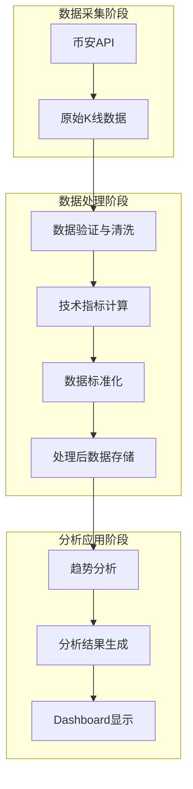
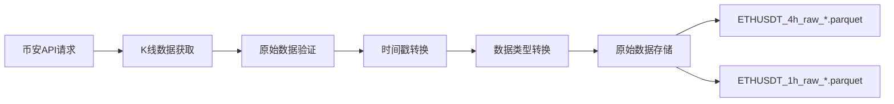
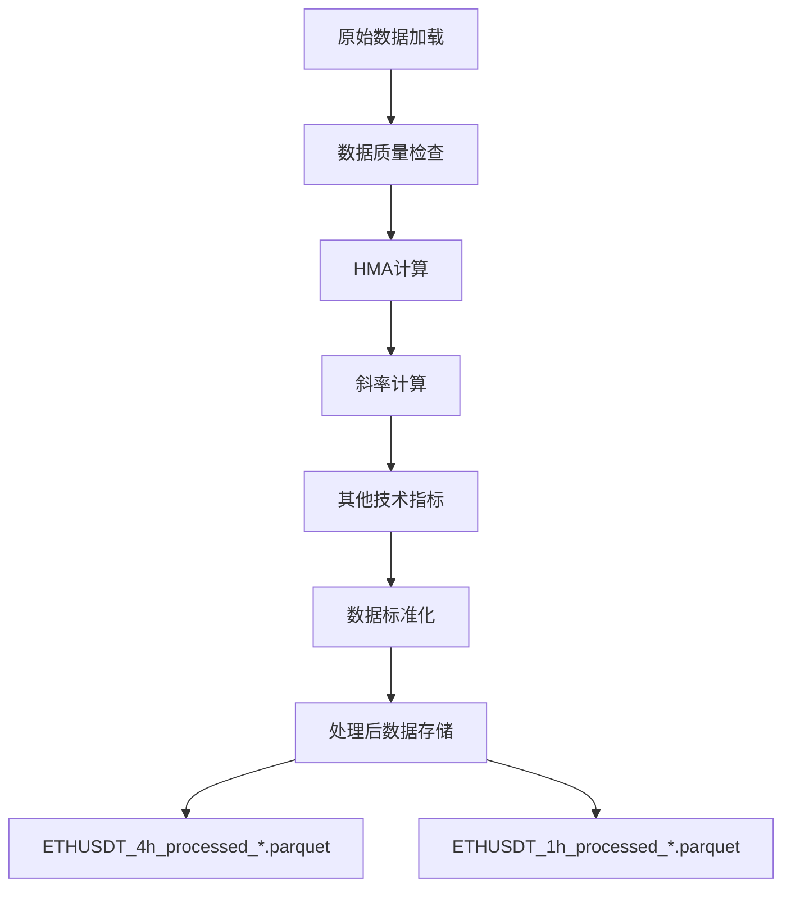
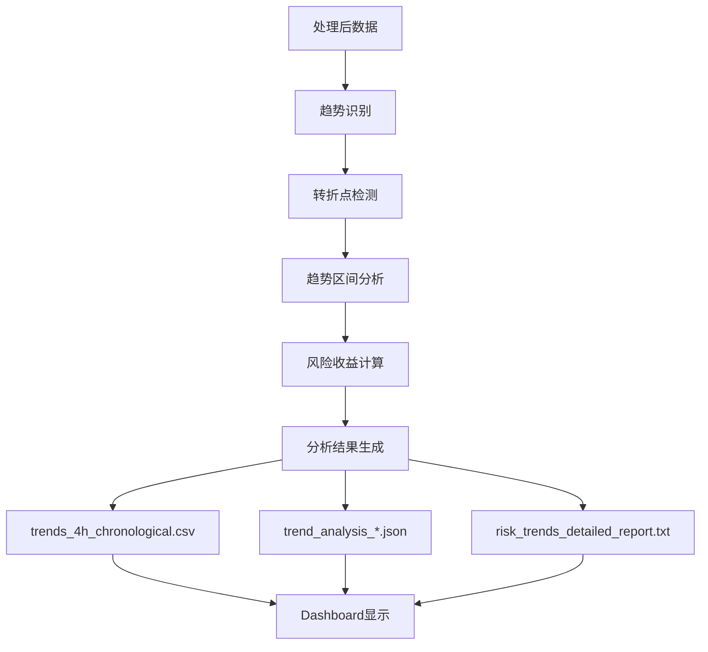
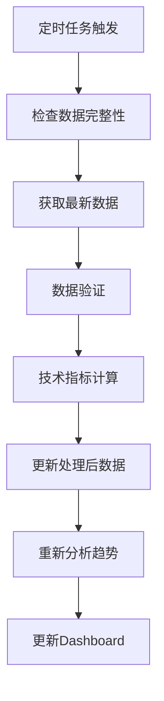
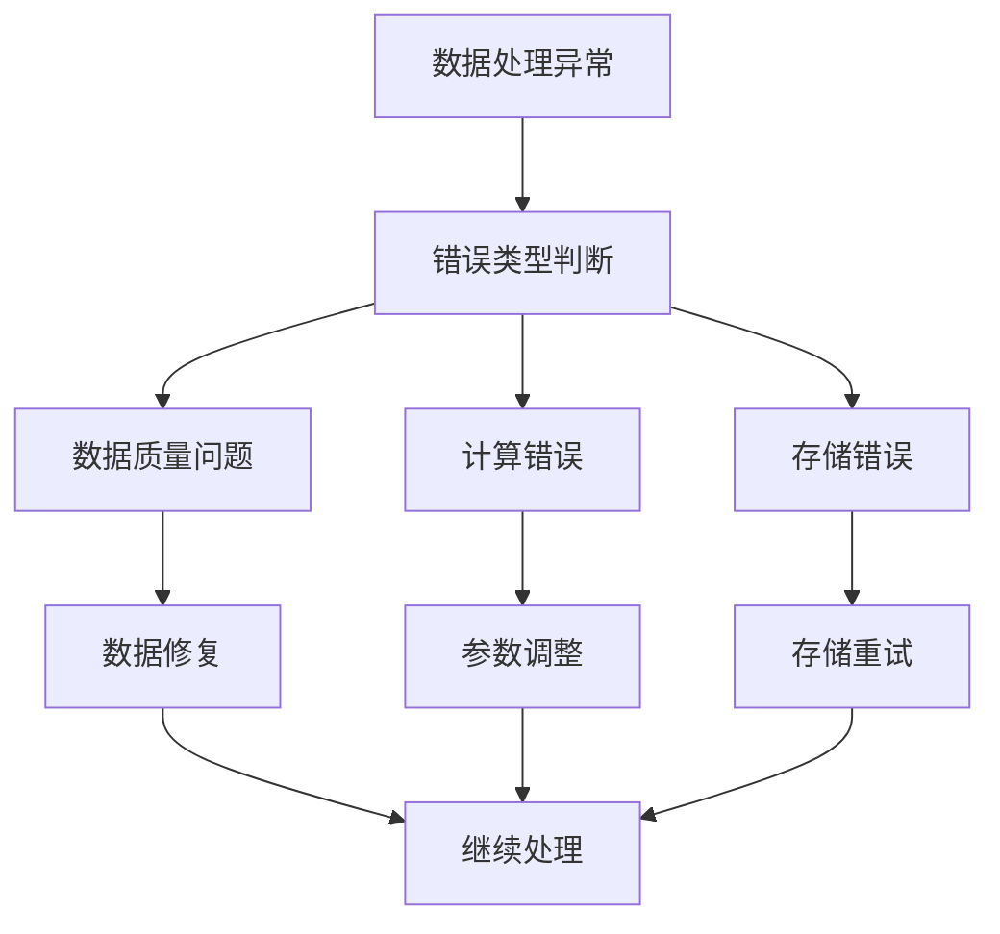

# 数据流程图解

## 📊 完整数据流程图



## 🔄 详细数据流说明

### 1. 数据采集阶段



### 2. 数据处理阶段



### 3. 分析应用阶段



## 📁 数据存储结构图

```
ETH_HMA_Analysis/
├── 📁 src/utils/data/                    # 核心数据存储
│   ├── 📄 ETHUSDT_1h_raw_*.parquet      # 1小时原始数据
│   ├── 📄 ETHUSDT_1h_processed_*.parquet # 1小时处理后数据
│   ├── 📄 ETHUSDT_4h_raw_*.parquet      # 4小时原始数据
│   └── 📄 ETHUSDT_4h_processed_*.parquet # 4小时处理后数据
├── 📁 assets/reports/                   # 分析结果存储
│   ├── 📄 trends_4h_chronological.csv   # 趋势数据CSV
│   ├── 📄 trend_analysis_*.json         # 趋势分析JSON
│   └── 📄 risk_trends_detailed_report.txt # 风险趋势报告
└── 📁 assets/charts/                    # 图表文件存储
    └── 📄 *.png                         # 分析图表
```

## 🔧 技术指标计算流程

```mermaid
graph TD
    A[价格数据] --> B[WMA计算]
    B --> C[WMA(n/2)计算]
    C --> D[WMA(n)计算]
    D --> E[HMA计算]
    E --> F[斜率计算]
    F --> G[其他指标计算]
    
    G --> H[价格变化率]
    G --> I[成交量指标]
    G --> J[波动率指标]
```

## 📊 数据转换对比表

| 处理阶段 | 数据量 | 文件大小 | 主要变化 | 存储位置 |
|----------|--------|----------|----------|----------|
| 原始数据 | 8,760条(1年4h) | ~2MB | 基础K线数据 | `src/utils/data/` |
| 处理后数据 | 8,760条(1年4h) | ~3MB | +技术指标字段 | `src/utils/data/` |
| 分析结果 | 趋势数量 | ~1MB | 趋势分析结果 | `assets/reports/` |
| 图表文件 | 多个图表 | ~5MB | 可视化图表 | `assets/charts/` |

## 🎯 关键处理参数配置

```yaml
数据处理配置:
  HMA设置:
    周期: 45
    计算方式: WMA(2*WMA(n/2) - WMA(n))
  
  成交量指标:
    移动平均窗口: 20
    计算方式: volume / volume_ma
  
  波动率指标:
    计算窗口: 20
    计算方式: rolling_std
  
  数据存储:
    格式: Parquet
    压缩: snappy
    精度: float32
```

## 🔄 数据更新流程



## 🚨 错误处理流程



## 📈 性能优化建议

### 1. 数据存储优化
- 使用Parquet格式提高读写性能
- 启用数据压缩减少存储空间
- 优化数据类型减少内存占用

### 2. 计算性能优化
- 使用向量化操作替代循环
- 实现增量计算减少重复计算
- 添加缓存机制提高响应速度

### 3. 内存管理优化
- 分批处理大数据集
- 及时释放不需要的数据
- 使用内存映射文件处理大文件

---

*此文档提供了完整的数据流程图解，帮助理解整个数据处理和分析的流程。*
